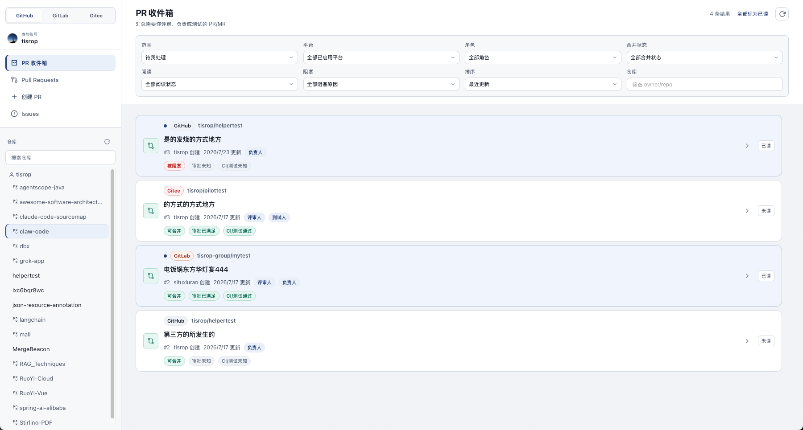
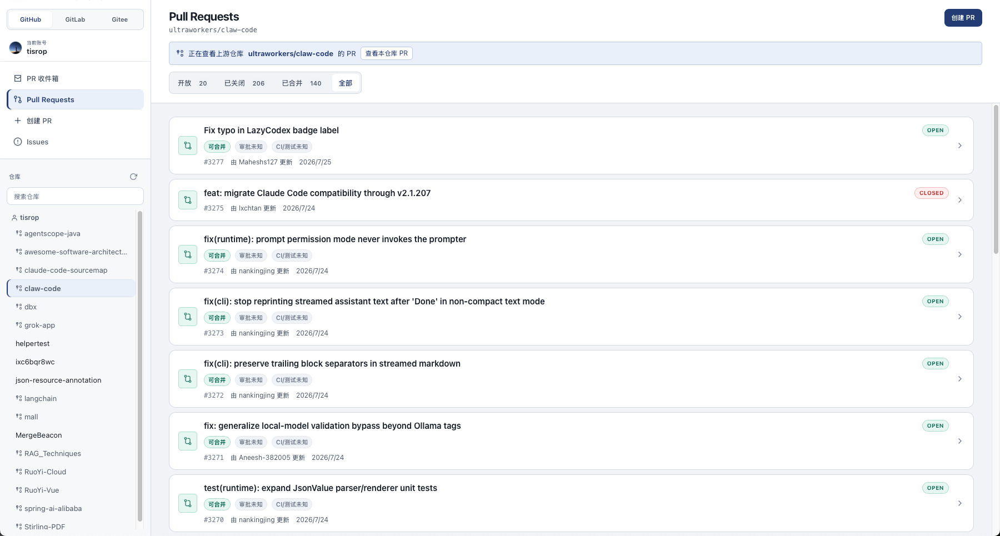
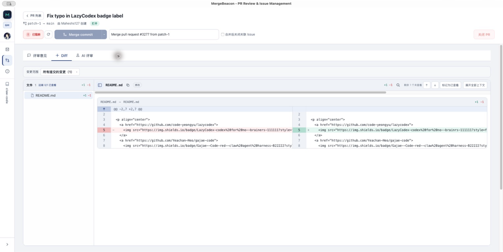
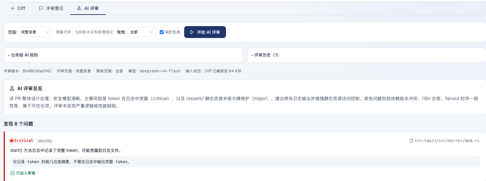

# MergeBeacon

[简体中文](README.md) | **English**

[](https://www.rust-lang.org)
[](https://v2.tauri.app)
[](https://vuejs.org)
[](LICENSE)

A cross-platform desktop client for PR review and Issue management, built with
**Tauri 2 + Vue 3 + Rust**. Connect GitHub, GitLab, and Gitee through one interface to
manage PR / MR inboxes, diffs, manual reviews, merges, and Issues, with optional AI-assisted
reviews through an OpenAI-compatible API.

> Current application version: `0.12.0`

## Screenshots

### Cross-platform PR inbox



### PR / MR list



### Diff review



### AI-assisted review



## Feature overview

- **Cross-platform PR inbox**
  - Aggregates PRs / MRs awaiting your action and those created by your account across enabled,
    signed-in platforms
  - Distinguishes GitHub / GitLab Reviewer and Assignee relationships, Gitee reviewer and tester
    relationships, and uses the scope filter for items authored by you
  - Shows approval, CI / test, Draft, conflict, and overall merge status directly on each card,
    with specific blockers available on hover
  - Filters by scope, role, merge status, platform, and `owner/repo`, with unified sorting by update time
  - Tracks read / unread state, new commits, new comments, and status changes, and supports sorting by
    blocker type and priority
  - Stores filter preferences and read state locally; refreshes at a low frequency while the app is
    visible and backs off when a platform rate-limits requests
  - Uses one batch status query per GitHub page; GitLab and Gitee prefer list fields to avoid per-item
    requests
  - Maintains pagination and errors independently for all three platforms, so one failed platform can
    be retried without affecting the others
  - Opens the matching platform, repository, and PR / MR detail directly from an inbox item
- **Multi-platform repository management**
  - Signs in to GitHub, GitLab, and Gitee with Personal Access Tokens
  - Keeps authentication, repository selection, Fork context, and pagination independent per platform
  - Supports incremental loading, deduplication, retry, independent refresh, and search across loaded
    repositories in the sidebar
  - Stars frequently used repositories locally per platform and groups them at the top of the sidebar
  - Supports self-hosted GitLab and Gitee addresses and normalizes their API version paths
- **Pull Requests / Merge Requests**
  - Filters by Open, Closed, Merged, or All, with combined title, author, label, review-state, and
    assignee / tester search
  - Sorts by best match, update time, creation time, or comment count; GitHub, GitLab, and Gitee all
    use server-side filtering and pagination
  - Supports previous / next page navigation, direct page selection, and 10 / 20 / 50 / 100 items per
    page, with an explicit message when a platform cannot continue pagination
  - Shows approval, CI / test, Draft, conflict, and overall merge status on Open list cards, with
    specific blockers available on hover
  - Enriches the current page through a cancellable batched status request, so stale work cannot
    overwrite a new filter, page, or repository context
  - Shows only the final closed or merged state for Closed / Merged lists, without continuing to query
    live approval and CI / test status
  - Displays title, author, branches, labels, merge status, and cross-platform merge-readiness checks;
    the detail-page check remains authoritative before merging
  - Edits title, Markdown description, Draft / Ready state, Reviewers, Assignees, labels, and Milestone
    according to platform capabilities
  - Previews Markdown descriptions, renders labels with platform colors, and displays each reviewer's
    review state on the detail page
  - Creates PRs / MRs from a repository page or the current platform's global entry point, with Fork
    source repositories, branch search, and participant / label selection
  - Refreshes source and target branches independently while preserving the current selection after a
    failed refresh and allowing retry
  - Previews commits and diffs before creation, including per-commit diff ranges; marks large comparison
    results explicitly when they are incomplete
  - Optionally displays read-only PR / MR dependencies and GitHub Merge Queue / GitLab Merge Train state
  - Detects a Fork's upstream repository and switches between the Fork and upstream repository
- **Diff and manual review**
  - Renders normalized patches as side-by-side diffs with diff2html
  - Finds code in the current text file with `⌘/Ctrl + F`, including case-sensitive, whole-word, and
    regular-expression matching
  - Switches supported image and video files between source and media views, with explicit errors for
    oversized, invalid, or failed media
  - Plays GitHub video attachments from restricted sources in Markdown descriptions and comments, while
    preserving the original safe link as a fallback
  - Provides file navigation, a diff-focused sidebar, renamed-path display, and per-file context
    expansion and collapse
  - Adds line comments to selected code on GitHub, GitLab, and Gitee
  - Categorizes comments as logic, security, performance, style, logging, and more
  - Submits quick comments with `⌘/Ctrl + Enter` and cancels with `Esc`
  - Displays overall reviews and line comments with code snapshots, outdated detection, and MiniDiffView
  - Groups GitHub comments by Review Thread and GitLab comments by Discussion; preserves read-only thread
    relationships on Gitee
  - Replies to threads and edits or deletes your own comments; resolves or reopens threads on GitHub and
    GitLab
  - Shows comment counts, unresolved thread counts, and viewed progress in the file tree, with navigation
    to the previous or next unviewed file
  - Warns about unviewed files and unresolved threads before review submission
- **PR merge, close, and reopen**
  - Shows merge strategies supported by the current platform and presents checks, approvals, conflicts,
    and permission state before merging
  - Supports custom merge commit titles and descriptions
  - Confirms the target repository and number before closing an open PR / MR, and can reopen a closed one
  - Can close linked Issues after a merge; a close failure is reported as partial success and never turns
    a successful merge into a failure
- **Issues**
  - Lists repository Issues and opens their details, rendering labels with platform-provided colors
  - Creates Issues with Markdown bodies, repository templates, and existing labels; returns to the list
    and displays the new item immediately after success
  - Renders Markdown descriptions and comments through an allowlist sanitizer and supports copying code
    blocks
  - Reads and posts comments, and edits title, description, state, and labels when the current Token has
    permission
  - Checks the remote update time before saving metadata to avoid overwriting recent changes from another
    client
  - Confirms the target repository and number before closing an Issue and can reopen a closed Issue
- **AI-assisted review**
  - Supports OpenAI-compatible Chat Completions and Models APIs
  - Includes presets for OpenAI, DeepSeek, Qwen, Moonshot, and Ollama
  - Supports connection tests, model list retrieval and search, Temperature, and Max Tokens settings
  - Supports regular responses and standard SSE streaming, with a unique `request_id` for every stream,
    and can stop the active review explicitly
  - Uses the current interface language for review findings by default, with a manual choice of Simplified
    Chinese or English before starting a review
  - Captures the selected review language when a review starts, so later interface-language changes do
    not affect the active request
  - Focuses on all changes, security, performance, logic, or code style and returns Critical / Major /
    Minor / Info findings
  - Adds findings directly to the review draft, adds an edited version, or ignores them, and navigates
    from a finding to its diff file and line
  - Records the reviewed `head_sha`, marks old results after a PR / MR update, and prevents submission of
    stale drafts
  - Compares the previous successful review version with the current version for incremental reviews and
    preserves review state while switching tabs
  - Stores repository-level local review rules and review history by `head_sha`, including model, scope,
    review language, and truncation state
  - Discovers repository rule files at the current commit; repository rules cannot override system safety
    constraints or trigger remote operations
  - Stores AI and manual drafts together locally and revalidates the current SHA and comment positions
    before submission
- **Desktop integration and updates**
  - Supports Simplified Chinese and English, defaults to Simplified Chinese, applies language changes
    immediately, and restores the selection on the next launch
  - Keeps the native menu in sync with the interface language and provides New PR / MR, New Issue,
    command palette, Settings, update, diagnostics, window, and help entries
  - Preserves desktop editing and view actions such as Undo, Redo, Cut, Copy, Paste, Select All, Reload,
    and Full Screen
  - Runs as a single instance and activates the existing main window when launched again
  - Restores window position, size, and maximized state safely
  - Supports signed update checks, download and installation, restart confirmation, and daily automatic
    checks from Settings
  - Updates the Windows portable edition manually through an official versioned ZIP
  - Copies redacted diagnostics containing version, system, credential-storage, and configuration state,
    without Tokens or private addresses
  - Shows or hides GitHub, GitLab, and Gitee entries independently
  - Configures desktop notifications by platform and event type; private-repository notifications hide
    repository names and titles by default
  - Checks review requests, completed CI / tests, new commits, new comments, and mergeability at a low
    frequency while the app is running
  - Opens the command palette with `Ctrl/⌘ + K` to switch platforms, search repositories and PRs, and
    trigger diff, AI review, and review-submission actions

## Platform capabilities

| Capability | GitHub | GitLab | Gitee |
|---|:---:|:---:|:---:|
| PAT sign-in and repository list | ✅ | ✅ | ✅ |
| Self-hosted instance address | — | ✅ | ✅ |
| Cross-repository PR / MR inbox | ✅ | ✅ | ✅ |
| PR / MR list, detail, and diff | ✅ | ✅ | ✅ |
| Create PR / MR | ✅ | ✅ | ✅ |
| Create Draft | ✅ | ✅ | Not supported |
| Manage title, description, participants, labels, and Milestone | ✅ | ✅ | ✅ |
| Merge-readiness check | ✅ | ✅ | ✅ |
| Incremental-review Compare Diff | ✅ | ✅ | ✅ |
| Overall review | Comment / Approve / Request changes | Comment (MR Note) | Comment (PR Comment) |
| View overall reviews | ✅ | ✅ | ✅ |
| Diff line comments | ✅ | ✅ | ✅ |
| Resolve / reopen review threads | ✅ | ✅ | Not supported |
| Viewed-file state | Remote sync | Local storage | Local storage |
| PR / MR dependencies (read-only) | ✅ | ✅ | ✅ |
| Merge Queue / Merge Train state (read-only) | ✅ | ✅ | Not supported |
| Merge strategies | Merge / Squash / Rebase | Merge / Squash | Merge / Squash / Rebase |
| Issue list, detail, and creation | ✅ | ✅ | ✅ |
| Issue comments and metadata management | ✅ | ✅ | ✅ |
| Fork upstream detection | ✅ | ✅ | ✅ |

> GitLab and Gitee support comment-only overall reviews. The interface does not show Approve or Request
> changes, and the backend rejects any event other than `comment`; unsupported events are never silently
> downgraded to ordinary comments.
>
> The Gitee API does not provide Draft switching, review-thread resolution, or viewed-file synchronization.
> The interface marks these capabilities as unsupported instead of simulating remote operations that do
> not exist.

## Technology stack

| Layer | Technology |
|---|---|
| Desktop framework | Tauri 2, Single Instance, Window State, Updater |
| Frontend | Vue 3, Composition API, Pinia, Vue Router |
| Frontend build | TypeScript, Vite 6 |
| Code quality | oxlint + oxfmt + frontend standards checker |
| Backend | Rust 2021, Tokio, Reqwest |
| Platform abstraction | `GitPlatform` trait + GitHub / GitLab / Gitee adapters |
| Diff rendering | Normalized patch, diff2html, highlight.js, code search, and bounded image / video preview |
| AI | OpenAI-compatible API, SSE streaming, incremental Compare Diff |
| Credential storage | System Keyring first, AES-256-GCM encrypted-file fallback |
| Local data | SQLite comment snapshot cache |
| Testing | Vitest, Vue Test Utils, jsdom, Cargo Test, WireMock |

## Quick start

### Requirements

- [Node.js](https://nodejs.org/) 20, the version used by project CI
- [Rust](https://www.rust-lang.org/tools/install) stable
- The [Tauri 2 prerequisites](https://v2.tauri.app/start/prerequisites/) for your operating system

### Install and run

```bash
git clone https://github.com/tisrop/mergebeacon.git
cd mergebeacon

npm install
npm run tauri -- dev
```

To run only the web frontend:

```bash
npm run dev
```

### Build the desktop application

```bash
npm run tauri -- build
```

The build runs `npm run build` automatically. Tauri writes artifacts to
`src-tauri/target/release/bundle/`. The macOS `.app` bundle name follows `productName` and is currently
`MergeBeacon.app`.

## Usage

### 1. Sign in to a Git hosting platform

Choose a platform on the sign-in page and enter a Personal Access Token. For a self-hosted GitLab or
Gitee instance, you can also enter the server address; MergeBeacon adds `https://` when no protocol is
provided.

| Platform | Token creation page |
|---|---|
| GitHub | [github.com/settings/tokens](https://github.com/settings/tokens) |
| GitLab | [gitlab.com/-/user_settings/personal_access_tokens](https://gitlab.com/-/user_settings/personal_access_tokens) |
| Gitee | [gitee.com/profile/personal_access_tokens](https://gitee.com/profile/personal_access_tokens) |

The Token needs at least read access to repositories, PRs / MRs, and Issues. Submitting reviews, posting
comments, changing metadata, merging, closing, or creating Issues requires the corresponding write access.

### 2. Use the PR inbox

1. Open **PR Inbox** from the sidebar.
2. Select "Awaiting my action" or "Created by me," then narrow the results by role, merge status,
   platform, or repository name.
3. Inspect the relationship, approval, CI / test, Draft, conflict, and overall merge status on each card.
4. Hover over the status summary to see blockers such as insufficient approvals, failed checks, or conflicts.
5. If one platform fails to load, use **Retry** in that platform's error message. Results already loaded
   from other platforms remain available.
6. Select an item to open its PR / MR detail page.

### 3. Review a PR / MR

1. Open an inbox item, or choose a platform and repository in the sidebar and open an item from the
   PR / MR list.
2. Inspect approval, CI / test, Draft, conflict, and overall merge status on Open list cards. Closed /
   Merged cards show only their final state.
3. On the detail page, check merge readiness for the latest checks, approvals, conflicts, and permissions.
4. Select a file on the **Diff** tab. Expand an individual hunk or all context when more code is needed.
5. Find code in a text diff with `⌘/Ctrl + F`; switch image files to **Preview** to compare before and after.
6. Select code and open the quick-comment form. All three platforms support line comments.
7. On the **Review comments** tab, filter threads by resolution state, reply, or navigate to unresolved
   threads. Resolve or reopen a thread only when the platform supports it.
8. Mark files as viewed in the file tree and review the unviewed-file and unresolved-thread warnings before
   submission.
9. When merging, choose a strategy supported by the current platform and confirm the linked-Issue option.

### 4. Create a PR / MR

1. Select **Create PR** or **Create MR** from the current repository's list, or start from the current
   platform's global entry point and choose a target repository.
2. Choose the target repository and branch, then the source repository and branch. In a Fork workflow,
   search the repositories already loaded for the current platform.
3. Inspect commits and diffs in the preview. Switch to a per-commit diff range when needed. Preview pages
   continue loading until the client safety limit is reached or the platform cannot return more data, at
   which point the preview is marked incomplete.
4. Enter a title and Markdown description, then choose Draft, Reviewers, Assignees, and labels according
   to platform capabilities.
5. If the platform API truncates the preview, acknowledge the incomplete-preview warning. It does not block
   creation of an otherwise valid large PR / MR.
6. After creation, MergeBeacon opens the detail page. If later writes such as participants or labels partly
   fail, the detail page preserves the successful result and displays a warning.

Creation only calls the remote platform API. It does not perform a local checkout, commit, push, or branch
change. Gitee does not support Draft creation, so the Draft option is not shown.

### 5. Manage Issues

1. Open **Issues** from the sidebar, select Open, Closed, or All, and choose an item to open its detail page.
2. Read the allowlist-sanitized Markdown description, labels, and comments, and copy code blocks as needed.
3. If the current Token has permission, edit the title, description, state, and existing repository labels.
   If remote content has changed, refresh the detail before saving again.
4. Enter Markdown in the comment form and post it; retry after a loading or submission failure.
5. Before closing an Issue, verify the platform, repository, and number in the confirmation dialog. Reopen a
   closed Issue from its detail page.
6. Apply a repository template and existing labels when creating an Issue. After success, the list opens and
   shows the new item immediately.

### 6. Configure and use AI review

1. Open **Settings → AI Review Settings**.
2. Select a preset or enter an OpenAI-compatible API endpoint.
3. Enter the API Key and select **Save Settings**.
4. Select **Fetch Models** and choose a model.
5. Adjust Temperature and Max Tokens, then use **Test Connection** to verify the configuration.
6. Open the **AI Review** tab for a PR / MR, choose a focus and **Review language**, and start the review.
   The review language follows the current interface by default and can be set independently to Simplified
   Chinese or English, and the active streaming review can be stopped when needed.
7. Add findings to the review draft, edit them, or ignore them. Select a file location to open the diff, then
   return to AI Review to continue.
8. After a new PR / MR commit, use an incremental review to compare the last successful version with the
   current version.
9. Save local repository review rules and inspect history by `head_sha`, model, focus, review language,
   and truncation state.
10. Confirm the combined AI and manual draft before submission. MergeBeacon revalidates the current commit
    and comment positions.

Common endpoint examples:

| Service | API endpoint | Example default model |
|---|---|---|
| OpenAI | `https://api.openai.com/v1` | `gpt-5.6` |
| DeepSeek | `https://api.deepseek.com/v1` | `deepseek-v4-flash` |
| Qwen | `https://dashscope.aliyuncs.com/compatible-mode/v1` | `qwen-plus` |
| Moonshot | `https://api.moonshot.cn/v1` | `moonshot-v1-8k` |
| Ollama | `http://localhost:11434/v1` | `llama3` |

AI requests include the PR / MR title, description, and target diff. To control input size, diffs larger
than approximately 64 KiB are truncated at a valid UTF-8 character boundary so Chinese text and emoji are
not split.

### 7. Configure desktop notifications and the command palette

1. Choose Simplified Chinese or English under **Settings → General**. The interface changes immediately and
   restores the selection on the next launch.
2. Open **Settings → Desktop Notifications**, grant system notification permission, and choose platforms and
   event types.
3. Keep "Hide private repository notification content" enabled to prevent notifications from showing
   repository names and PR / MR titles. This setting is enabled by default.
4. Keep the app running to receive low-frequency polling notifications. Network, permission, and platform
   rate-limit errors are shown in the app.
5. Open the command palette with `Ctrl/⌘ + K` to search platforms, repositories, PRs / MRs, or files in the
   current diff.

### 8. Update the app and copy diagnostics

1. Open **Settings → Application Updates** to check manually or enable daily automatic checks.
2. For an installed edition, confirm restart after the download. The Windows portable edition opens the
   official ZIP URL and must be replaced manually after exiting the app.
3. When reporting a problem, copy redacted information from **Settings → Diagnostics**. You can separately
   copy the latest 100 redacted error-log entries when investigating recent failures.

## Local data and security

- Platform Tokens are stored in the system credential store first: macOS Keychain, Windows Credential
  Manager, or Linux Secret Service. The service is `com.mergebeacon`, and the account is
  `git-platform:{platform}`.
- When the system credential store is unavailable, Tokens are encrypted with AES-256-GCM and written to
  `~/.mergebeacon/config.json`. Directory and file permissions are restricted to `0700` and `0600`,
  respectively, and writes are atomic.
- The legacy `com.mergepilot` Keyring, `~/.mergepilot/config.json`, and plaintext `token_{platform}` values
  are migrated on first read. Old values are deleted only after the destination write succeeds.
- Self-hosted instance addresses remain in ordinary configuration. An HTTP address should only be used on a
  trusted local network because Token transport is not protected by TLS.
- AI configuration is stored in `ai_config.json` under the operating system's application configuration
  directory. The AI API Key is encrypted with AES-256-GCM and has not yet migrated to the system Keyring.
- Inbox read state, file-review progress, review drafts, AI review history, and repository-level AI rules
  use WebView `localStorage`, isolated by platform, repository, PR / MR, and commit version. This data does
  not contain platform Tokens.
- A sign-in Token is sent only to the selected Git hosting platform. The AI API Key is sent only to the
  configured AI endpoint.
- Updates accept only the configured official update source and metadata and installers verified by the
  configured Minisign public key.
- Diagnostics redact self-hosted platform addresses, non-official AI addresses, and credential values.
- Error logs are stored at `logs/mergebeacon-errors.jsonl` under the system application data directory.
  Each file is limited to 512 KiB, with up to three rotated archives. Logs contain only time, command,
  operation, request identifier, error category, and HTTP status; they do not contain Tokens, API Keys,
  repository code, remote bodies, or complete self-hosted addresses.
- The macOS application identifier is `com.mergebeacon`.

Protect the local account and configuration-file permissions. Do not commit local configuration files or
store credentials on an untrusted device.

## Project structure

```text
mergebeacon/
├── src/
│   ├── api/index.ts             # The only Tauri IPC wrapper entry point
│   ├── components/
│   │   ├── ai/                  # AI settings, streaming/incremental review, history, findings
│   │   ├── command/             # Global command palette
│   │   ├── diff/                # Normalized diff, search, media preview, context, quick comments
│   │   ├── inbox/               # Cross-platform PR inbox cards
│   │   ├── issue/               # Issue cards and forms
│   │   ├── layout/              # Application layout, platform and repository sidebars
│   │   ├── notification/        # Desktop notification management and settings
│   │   ├── pr/                  # PR cards, filters, and merge-readiness state
│   │   ├── review/              # Overall review and comment lists
│   │   └── shared/              # Shared forms and state components
│   ├── pages/                   # 9 pages: sign-in, inbox, PR, Issue, and Settings
│   ├── router/index.ts          # 11 route records and sign-in restoration guard
│   ├── stores/                  # 11 Pinia stores for auth, capabilities, repos, PRs, Issues, notifications, and review state
│   └── types/index.ts           # Shared frontend types
├── src-tauri/
│   ├── src/
│   │   ├── ai/                  # OpenAI-compatible client, prompt, and configuration
│   │   ├── commands/            # Auth, diagnostics, updates, capabilities, native menu, notifications, PR, review, Issue, AI
│   │   ├── platform/            # GitPlatform trait and three platform adapters
│   │   ├── file_content.rs      # Diff context and bounded media-content processing
│   │   ├── native_menu.rs       # Localized native menu and desktop actions
│   │   ├── patch.rs             # Cross-platform patch normalization
│   │   ├── single_instance.rs   # Single-instance window activation
│   │   ├── window_state.rs      # Safe window-state restoration
│   │   ├── local_store.rs       # SQLite comment snapshot cache
│   │   ├── error_log.rs         # Redacted, size-limited, securely rotated error logs
│   │   ├── state.rs             # Shared state, update coordination, cancellable task registries
│   │   └── vault.rs             # TokenVault with Keyring-first, encrypted-file fallback
│   ├── tests/                   # GitHub / GitLab / Gitee WireMock integration tests
│   ├── Cargo.toml
│   └── tauri.conf.json
├── AGENTS.md                    # Project context and constraints for AI coding agents
├── CODE_STANDARDS.md            # Implementation and review standards
├── FRONTEND_STANDARDS.md        # Frontend visual, interaction, and accessibility standards
├── package.json
├── README.en.md                 # English README
└── README.md                    # Simplified Chinese README
```

## Coding standards

Development and code review use [`CODE_STANDARDS.md`](CODE_STANDARDS.md) as their baseline. It covers
Vue / TypeScript and Rust / Tauri architecture boundaries, cross-platform behavior, asynchronous lifecycle,
credential security, testing requirements, and merge gates. Frontend pages, components, and styles must
also follow [`FRONTEND_STANDARDS.md`](FRONTEND_STANDARDS.md), while AI coding agents additionally follow
[`AGENTS.md`](AGENTS.md).

Changes involving authentication, platform switching, pagination, inbox behavior, AI lifecycle, diff
context, updates, or merge outcomes must include regression tests for success, failure, and race paths.

## Development and testing

```bash
# Frontend type checking, build, and tests
npm run build
npm test

# Linting, formatting, and project gates
npm run lint
npm run format
npm run check:frontend-standards
npm run check:version
npm run check:updater
npm run check:frontend
npm run lint:fix
npm run format:fix

# Rust formatting, static checks, and tests
cd src-tauri
cargo fmt --all -- --check
cargo clippy --all-targets -- -D warnings
cargo test
```

The application currently registers 70 Tauri Commands:

- Authentication (5): `auth_login`, `auth_logout`, `auth_check`, `auth_has_any_token`, `auth_has_token`
- Diagnostics, updates, platform capabilities, and native menu (11): `support_info`,
  `copy_support_info`, `copy_recent_error_logs`, `clipboard_write_text`, `error_log_record`, `app_version`,
  `update_check`, `update_download_and_install`, `update_restart`, `platform_capabilities`,
  `native_menu_set_labels`
- Repositories (1): `repo_list`
- Desktop notifications (3): `desktop_notification_permission_granted`,
  `desktop_notification_request_permission`, `desktop_notification_send`
- Inbox and PR / MR (23): `review_inbox_list`, `pr_list`, `pr_list_statuses`,
  `pr_list_statuses_cancel`, `pr_detail`, `pr_dependencies`,
  `pr_merge_queue_status`, `pr_branches`, `pr_labels`, `pr_templates`, `pr_description_image_upload`,
  `pr_participant_suggestions`, `pr_create_preview`, `pr_create`, `pr_metadata_update`,
  `pr_merge_readiness`, `pr_diff`, `pr_commits`, `pr_compare_diff`, `pr_file_content`, `pr_merge`,
  `pr_close`, `pr_reopen`
- Review (10): `review_submit`, `review_comment_add`, `review_thread_reply`, `review_comment_update`,
  `review_comment_delete`, `review_list`, `review_comments_list`, `review_thread_set_resolved`,
  `review_viewed_files_list`, `review_file_set_viewed`
- Issues (7): `issue_list`, `issue_detail`, `issue_create`, `issue_metadata_update`,
  `issue_comments_list`, `issue_comment_add`, `issue_templates`
- AI (10): `ai_get_config`, `ai_save_config`, `ai_save_api_key`, `ai_pr_draft`,
  `ai_pr_draft_cancel`, `ai_review`, `ai_review_stream`, `ai_review_cancel`, `ai_list_models`,
  `ai_test_connection`

## Known limitations

- GitLab and Gitee support comment-only overall reviews. Only GitHub supports native Approve and Request
  changes events.
- Gitee does not support Draft, thread resolution, or remote viewed-file state. GitLab viewed-file state is
  also stored only locally.
- Commit / diff previews on the creation page are limited by the platform Compare API and client pagination
  safety limits. MergeBeacon warns when it detects truncation, a later page fails, or the limit is reached;
  the user can still create a PR / MR after confirming the range.
- Historical Closed or Merged lists are subject to platform pagination limits. GitHub exposes at most the
  first 1,000 items; GitLab and Gitee display an explicit message when pagination cannot continue.
- Dependencies and Merge Queue / Merge Train state are read-only. Dependency discovery is limited by
  platform APIs, pagination, and query limits; MergeBeacon does not automatically restack, enqueue, or run
  an independent client scheduler.
- Desktop notifications use low-frequency polling only while the app is running. There is no server push or
  resident background notification service after the app exits.
- AI rules, review history, and drafts are stored only locally and do not support team-level synchronization.
  This capability is not planned for the near term.
- Windows / Linux window, single-instance, and system-notification testing has not yet been performed.
  Real macOS secondary-display disconnection recovery is also deferred.
- Self-hosted servers may still use HTTP for local and intranet compatibility. Do not transmit Tokens over
  HTTP on an untrusted network.
- The Windows portable edition does not overwrite itself in-app. Download the official ZIP, exit the app,
  and replace it manually.
- AI output must contain one complete review JSON object in the agreed structure. A model that does not
  follow that structure may cause parsing to fail.
- Tauri command errors use stable error codes, Chinese messages, retryability, and optional HTTP status,
  which the frontend converts into `ApiError`. The backend also writes redacted error metadata to stderr
  and a size-limited local JSONL file. Recent errors can be copied from Settings, and a logging failure never
  replaces the original command error.

## Links and community

This project is interested in open-source collaboration and technical exchange. Visit the
[LINUX DO](https://linux.do/) community to connect with other developers, share experience, and discover
interesting open-source projects.

## License

[Apache 2.0](LICENSE)
